# NewBee\_HK\_MVP\_PRD\_在线文档\_v1\.1\_大陆评审版

# NewBee 香港用工平台 MVP PRD

## v1\.4 统一修订口径：基于思维导图修改与评论

本节为 v1\.4 最新口径，优先级高于前文 v1\.2 中与本节冲突的描述。研发实现时，以“本节规则 \+ 后续同步更新的数据字典/线框图/思维导图”为准。

### 1\. 本轮必须统一的产品规则

|业务域|最新规则|落地说明|
|---|---|---|
|商户准入|商户注册并提交审核后，不论审核是否通过，都可进入商户后台。|未审核通过时，后台只开放工作台、资料补充、审核状态、消息通知、个人资料/设置；创建岗位、排班、急招、账单等关键动作置灰或拦截，提示“商户资料尚未审核通过”。|
|授信与发岗|商户创建岗位时，系统校验当前待结算/代结算金额是否超过授信额度。|未超过授信可提交岗位审核；超过授信则阻止提交，提示“待结算金额已超过授信，请先结算或联系平台调整额度”。商家自结岗位不占用平台代发授信，但仍需平台审核。|
|岗位结算方式|创建岗位/班次时必须选择薪资发放方式：平台结算或商家自结。|平台结算进入钱包记账、发薪申请、商户账单、授信占用链路；商家自结只记录工时、考勤和凭证，不产生平台代发工资和授信占用。|
|急聘轻量化|“急聘/熟工免审”一期降级为“平台开启岗位急聘置顶”。|平台可对岗位开启急聘；开启后 C端首页岗位排序置顶并显示“急聘”标签。雇员仍走岗位申请，是否免审/自动排班不作为一期默认能力，避免规则过重。|
|急招补人|商户仅在开工前 6 小时内使用急招补人。|急招候选池仅展示已开启临时可上工、时间不与岗位/排班冲突、地区/工种/薪资匹配且未被标签拦截的雇员。商户可单个/批量邀请，也可在权限开放后自行联系。|
|工时复核|MVP 保留平台复核，但采用“风险驱动复核”。|正常考勤且无金额异常的工时可批量通过；存在补卡、缺勤、超时、薪资调整、商户异议、员工申诉、超过阈值金额时进入平台人工复核。这样满足财务风控，又不把平台做成重型 OA。|
|商户评价|商户确认工时时可评价员工，评价仅本商户可见。|评价不做员工公开评分，不影响其他商户默认视图；平台可在风控审计中查看评价来源，并可转化为平台标签。|
|平台发薪记录|平台线下发薪后，需在线上传凭证并提交实际发薪金额。|系统按实际发薪金额扣减雇员待支付余额，更新平台代发薪账户余额，并同步进入商户账单/应收记录。|

### 2\. 商户端与平台端首页/设置统一规则

|端|首页仪表盘|右上角统一入口|
|---|---|---|
|商户Web|展示认证状态、授信额度/已占用/剩余额度、待审核申请、待排班人数、今日上工人数、考勤异常、待确认工时、待确认账单、急招缺口、近期岗位表现。|个人资料、商户资料、团队成员与权限、门店地点、通知设置、账号安全、退出登录统一放在右上角头像/组织菜单，不再作为左侧主业务导航。|
|平台Web|展示商户待审核、岗位待审核、今日排班/缺口、急招邀请、考勤异常、补卡待审、工时待复核、发薪待处理、商户账单待确认、逾期回款、授信预警、标签待审。|个人资料、角色权限、成员管理、系统设置、通知模板、审计策略、退出登录统一放在右上角平台账号菜单，左侧导航只保留业务运营模块。|

### 3\. WhatsApp 推送能力判断与 MVP 方案

WhatsApp 没有与微信公众号完全等价的“关注后免费群发/订阅号推送”模式。可行方式是接入 WhatsApp Business Platform / Cloud API，使用企业 WhatsApp 号码、模板消息和 Webhook 实现提醒。

|能力|可行性|MVP 设计口径|
|---|---|---|
|主动提醒|可通过已审核模板消息发送，如 OTP、申请结果、排班提醒、急招邀请、补卡结果、发薪结果、账单提醒。|MVP 设计 notifications 表记录站内信、WhatsApp、短信三类通道；WhatsApp 模板先做接口预留和模板状态字段，实际上线可先人工/第三方 BSP 兜底。|
|自由文本|仅在用户主动发起对话后的 24 小时客服窗口内可发送自由消息；窗口外必须使用审核通过的模板消息。|所有系统提醒按模板化变量设计，不依赖自由文本群发。需要人工沟通时，在商户/平台端开放“复制联系方式/打开 WhatsApp”辅助人工联系。|
|合规前提|必须取得用户手机号和 WhatsApp 接收授权，并提供退订/停止接收路径。|C端注册和通知设置中增加“同意接收 WhatsApp 工作提醒”；用户可关闭非必要提醒，但 OTP、排班、发薪等必要服务通知按合规模板处理。|

参考：WhatsApp Business Messaging Policy 要求企业仅在获得手机号和 opt\-in 后联系用户；平台主动会话需使用 approved Message Template，24 小时窗口外也只能通过模板消息发送；Cloud API 的 WABA、Business Phone Number、Message Templates 和 Webhooks 支持发送、接收与状态回调。

[WhatsApp Business Messaging Policy](https://whatsappbusiness.com/policy/) ；[Meta Cloud API Overview](https://meta-preview.mintlify.io/docs/whatsapp/cloud-api/overview)

### 4\. 轻量排班方案：班次模板 \+ 排班实例 \+ 调整单

一期不做完整 OA 排班系统，而采用“岗位班次模板生成排班实例，商户可批量调整，异常用调整单留痕”的轻量方案，保证后续可扩展但不重做。

|用工类型|一期排班方式|后续可扩展点|
|---|---|---|
|长期工|创建周期班次模板，如每周一至五 09:00\-18:00；系统按周期生成未来 7\-14 天排班实例。节假日、请假、调班通过排班调整单处理。|后续可增加香港公众假期日历、请假审批、周期排班复制、自动补位。|
|长散工/兼职|按周创建可变班次，商户在排班日历中手动分配人员，可复制上周排班后局部调整。|后续可增加员工可用时间、偏好规则、冲突检测增强、推荐排班。|
|短期临时工|按岗位/活动创建单次或连续多日班次，录用后生成排班实例；临时缺勤时进入急招补人。|后续可增加活动批量导入、候选人推荐和自动替补。|

### 5\. v1\.4 关键时序图

#### 模块A：商户准入与发岗授信校验

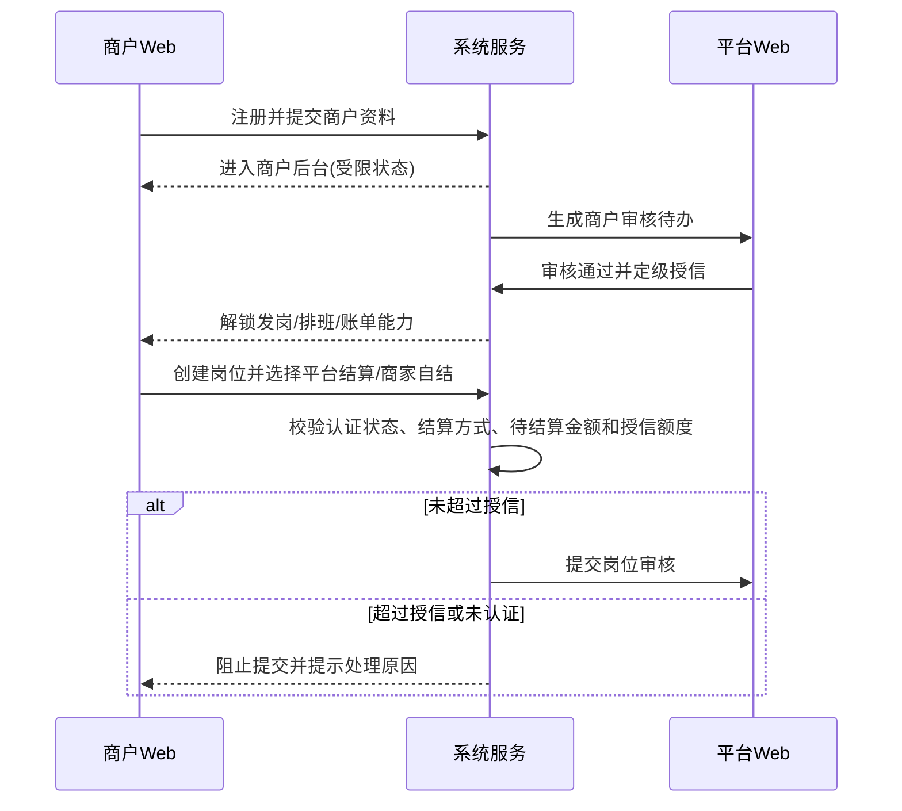

#### 模块B：轻量排班、调班与急招补人

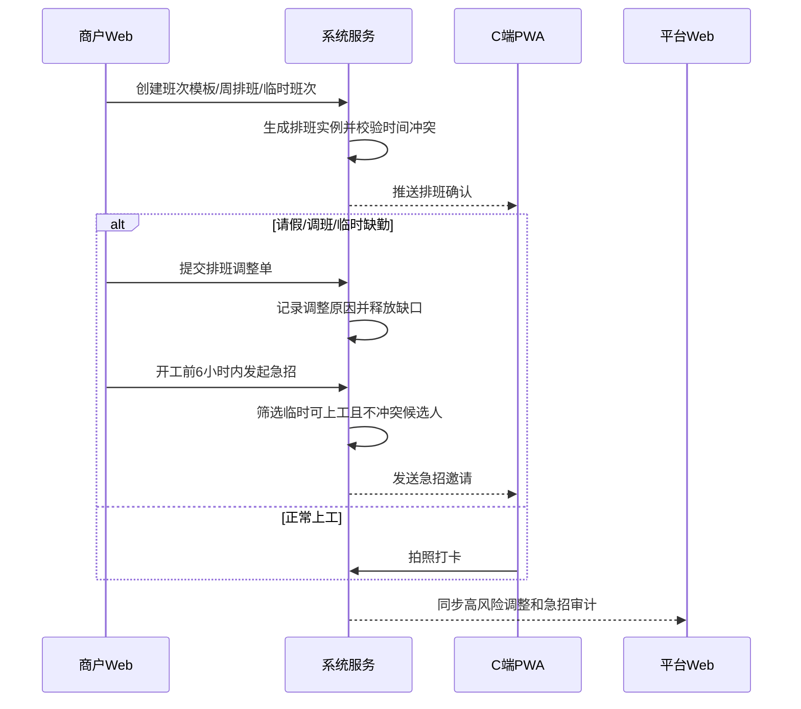

#### 模块C：工时确认、商户评价、平台风险复核与发薪

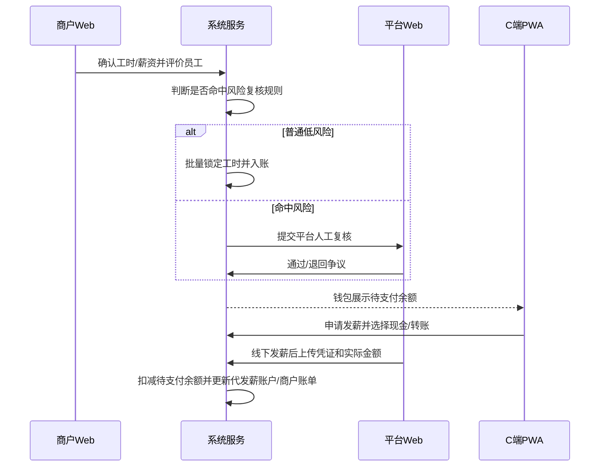

> 版本：v1\.1 大陆评审版
生成日期：2026\-06\-06
范围：以《N**ewBee开发规划\_功能模块\_按优先级》中“邦芒确认优先级=P0”为 MVP。**
**产品形态：C端手机PWA、商户Web、平台Web。**
语言口径：内部评审文档使用简体中文，便于大陆团队与开发评审。

## 

## 1\. MVP定位与本次调整

NewBee 香港用工平台 MVP 聚焦“商户发布岗位 \- 求职者~~报名~~申请 \- 商户审核排班 \- 拍照打卡 \- 商户确认工时 \- 平台复核结算 \- 雇员申请发薪 \- 平台线下发薪确认 \- 商户账单确认 \- 商户线下付款申请 \- 平台确认收款”的第一个可运营闭环。

本版明确取消面试/Offer功能。雇员~~报名~~申请后，普通~~报名~~申请由商户审核，通过后排班；~~熟工快捷~~~~报名~~~~申请~~~~在系统校验通过后可直接排班。~~临时缺人场景通过全局临时可上工池发起急招邀请，雇员接受后再排班。

一期不追求所有外部服务全自动化。OTP、调用相机拍照打卡、地点时间记录、文件上传按照真流程设计；HKID验证、FPS发薪、WhatsApp群组、人脸比对先保留接口与人工兜底后台，避免项目被第三方接入阻塞。所有资金交易不直接线上化，线上钱包只做记账。

## 2\. MVP P0模块覆盖

|ID|模块|子功能|MVP处理|
|---|---|---|---|
|1|账号与用户体系|手机号\+OTP登录|手机 OTP 登录；|
|2|账号与用户体系|用户总表|创建三端统一 User 主表与多角色关联。|
|3|账号与用户体系||分为三端，不涉及|
|4|岗位模块|岗位列表<br>|默认推荐排序为简易的岗位更新时间倒序，商户若设置急聘（熟工免审），将增加排序权重，雇员c端可选默认综合排序、距离排序基于香港18区的地理位置 ，也可筛选行业、全职/兼职/临时工等|
|5|岗位模块|岗位卡片|港币呈现，由商户设置是时薪还是日薪还是月薪|
|6|岗位模块|岗位搜索|需适配香港工种分类和双语搜索|
|7|岗位模块|岗位筛选|地区筛选改用香港18区\+MTR站；移除地铁筛选改用MTR沿线|
|8|岗位模块|岗位详情\(详情页\)||
|9|~~报名~~申请模块|C端~~报名~~申请流程|C端~~报名~~申请流程保留资料补全、上岗须知、班次选择；取消面试环节，~~报名~~申请后由商户审核并排班。|
|10|~~报名~~申请模块|B端处理~~报名~~申请|B端~~报名~~申请处理只保留~~报名~~申请审核、员工资料查看、通过后排班；取消面试/Offer状态。|
|11|日结模块|日结薪资|需适配香港最低工资条例|
|12|考勤模块|打卡（上班打卡、下班打卡）|考勤页面可看到排班日历，点击打卡按钮自动调用相机，拍摄提交自动记录打卡时间、地点|
|13|考勤模块|补卡申请|选择补卡岗位，选择实际工作时间，添加实际工作证明（图片），并填写理由|
|14|考勤模块|工时确认|无需调整|
|15|个人中心|我的页|需增加求职记录/浏览记录/收藏/钱包/简历/设置|
|16|个人中心|实名认证\(HKID\)|需对接香港HKID验证服务|
|17|消息模块|站内通知|无需调整|
|19|消息模块|多渠道触达优先级|调整为：站内→WhatsApp→PUSH→SMS|
|20|通用规范|分享功能|微信/WhatsApp/Telegram分享，方式为复制链接，打开该软件，提示已复制链接，粘贴分享|
|21|结算模块|钱包|钱包只做线上记账，不做线上交易；雇员线上申请发薪，平台线下支付后确认扣减钱包。完成工作雇员和平台确认后，薪酬将累积到钱包，可以看到过往记录和代发薪余额，同时有申请发薪选项，平台管理页面将看到。mvp阶段发薪以线下为主，线下交易完成后，平台可确认已发薪，雇员钱包将更新数额。|
|22|结算模块|商户账单|无需调整|
|23|团队管理|团队邀请|无需调整|
|24|团队管理|角色权限|无需调整|
|25|排班模块|排班管理|无需调整|
|26|商户准入与授信|商户认证审核|BR、负责人 HKID、公司资料上传；OCR 与第三方核验作接口预留，平台人工审核兜底。|
|27|商户准入与授信|商户分级与授信|MVP 阶段商户等级和授信由平台手动赋予；商户注册/审核时即可定级，不同等级自动带出授信额度。|
|28|~~报名~~申请模块|~~候选补位机制~~全局临时可上工池|~~候补改为补位意向池：员工表达愿意被临时通知，不锁定其时间；发生缺勤时再发补位邀约。~~~~候选补位机制改为全局临时可上工池~~全局临时可上工池：雇员主动开启可上工状态并设置时间、地区、工种、最低薪资和联系方式授权；商户仅在距离开工12小时内的岗位/班次中发起急招邀请，雇员接受并通过系统校验后生成排班。|
|29|~~报名~~申请模块|~~抢班模式~~急聘/熟工免审|~~抢班改为熟工快捷~~~~报名~~~~申请~~~~：仅对历史合作合格员工开放一键确认，系统校验冲突和名额后直接生成排班。~~~~抢班改为急聘/熟工免审：~~急聘/熟工免审：商户发布岗位时可开启急聘，符合历史合作合格、无爽约、证书满足、无时间冲突等条件的熟工可一键确认上工；系统校验名额、冲突、证书和标签后直接生成排班，非熟工仍走普通~~报名~~申请审核。|
|30|核身与工作码|冒用检测|工作码扫码时记录人脸核验状态与疑似冒用事件；一期不做信用分扣分，改为平台内部风控标签。|
|31|消息模块|WhatsApp群组|保留 WhatsApp 群组记录与外部 ID；一期支持运营手动建群回填，后续对接 Business API。|
|32|人才模块|信用体系|不创建员工公开评分；一期仅支持商户/平台可见的优先录用、不推荐、黑名单、风险备注等标签。|

## 3\. 三端产品架构

### 3\.1 C端手机PWA

- 登录 / OTP 验证

- 身份与实名认证：HKID、地址证明、收款资料

- 在线简历：工作经验、技能证书、语言能力、PDF下载

- 找工作：推荐、~~搜索、筛选、收藏、分享~~搜索、筛选、收藏、分享、开启/关闭临时可上工

- 职位详情：公司、门店、岗位三类详情

- ~~报名~~~~申请~~~~ / 熟工快捷~~~~报名~~~~申请~~~~ / 补位意向：选班次、确认上岗须知、资料补全~~~~报名~~申请 / 急聘熟工免审 / 临时可上工：选班次、确认上岗须知、资料补全、急招邀请确认

- 我的排班：日历、上工提醒、请假 / 调班入口

- 出勤：调用相机拍照打卡，记录地点和时间，补卡申请，工时确认

- 钱包：待支付余额、发薪申请、收款确认、记账流水

- 消息：站内通知、WhatsApp 兜底提示、系统公告

- ~~我的：求职记录、工作记录、在线简历、技能证书、设置与客服~~我的：求职记录、工作记录、在线简历、技能证书、临时可上工设置、联系方式授权、设置与客服

### 3\.2 商户Web

- 首页工作台：待处理~~报名~~申请、待确认工时、待确认账单

- 团队与角色：负责人、成员、邀请链接、权限范围

- 商户资料：企业资料、BR、负责人 HKID、协议状态、平台定级和授信额度

- 门店 / 地点：工作地址、地理围栏、对接人

- ~~岗位管理：提交需求、草稿、待审、已发布、已关闭~~岗位管理：提交需求、草稿、待审、已发布、已关闭、急聘熟工免审开关、急招补人入口

- ~~报名~~申请处理：候选人列表、在线简历/PDF、批量审核、通过后排班

- ~~排班管理：班次日历、模板、名单、补位意向池、熟工快捷~~~~报名~~~~申请~~~~名单~~排班管理：班次日历、模板、名单、急招补人、可用雇员筛选、批量邀请、急聘熟工免审名单

- 工时确认：打卡照片、地点、时间、异常、补卡审核结果

- 账单与垫资：账单确认、异议、线下已付款申请、平台确认收款

- 消息中心：平台通知、逾期提醒、操作记录

### 3\.3 平台Web

- 平台总览：商户、岗位、~~报名~~申请、出勤、结算风险

- 商户审核：BR / HKID / 协议 / 手动定级 / 授信额度

- 岗位审核：内容、薪资、班次、保险、授信校验

- ~~招聘运营：~~~~报名~~~~申请~~~~审核、补位意向池、熟工快捷~~~~报名~~~~申请~~~~、WhatsApp 群组~~招聘运营：~~报名~~申请审核、临时可上工池管理、急招邀请审计、急聘熟工免审规则、WhatsApp 群组

- ~~排班运营：排班模板、补位邀请、上工提醒~~排班运营：排班模板、急招邀请、上工提醒、联系方式开放审计

- 考勤异常：打卡照片、地点、时间、漏卡、冒用疑似、补卡审批

- 简历与证书：员工在线简历、技能证书、PDF导出

- 结算中心：工资草稿、周汇总、锁定、线下发薪确认

- 商户账单：账单草稿、确认、异议、线下付款确认、逾期

- 授信风控：客户级别、授信额度、垫资余额、逾期限制

- 标签与审计：员工标签、黑名单、操作日志、文件库

## 4\. 角色与权限

|端|角色|核心权限|限制|
|---|---|---|---|
|C端|求职者|~~浏览职位、~~~~报名~~~~申请~~~~/熟工快捷~~~~报名~~~~申请~~~~、打卡、补卡、查看钱包、申请发薪、维护在线简历~~浏览职位、普通~~报名~~申请、急聘熟工免审确认、开启临时可上工、接受急招邀请、打卡、补卡、查看钱包、申请发薪、维护在线简历|不可查看商户内部价、不可查看他人资料<br>|
|商户Web|负责人<br>|~~管理企业资料、邀请成员、提交岗位、审核~~~~报名~~~~申请~~~~、排班、确认工时、确认账单、提交线下付款申请~~管理企业资料、邀请成员、提交岗位、开启急聘熟工免审、审核~~报名~~申请、急招补人邀请、排班、确认工时、确认账单、提交线下付款申请|~~不可直接跳过平台审核与结算锁定~~不可直接跳过平台审核与结算锁定；雇员未接受急招邀请或未进入排班前，不可查看完整联系方式或强制排班|
|商户Web|成员|按授权处理岗位、~~报名~~申请、排班、工时或账单|不可管理授信、协议、负责人资料|
|平台Web|超管|全量配置、角色、审计、风控开关、异常兜底|需记录所有高风险操作|
|平台Web|运营<br>|~~商户/岗位审核、招聘排班、考勤异常、员工简历证书、标签管理~~商户/岗位审核、招聘排班、临时可上工池管理、急招邀请审计、联系方式开放审计、员工简历证书、标签管理|不可锁定结算、不可记录实付款<br>|
|平台Web|财务|结算复核、发薪任务、商户账单、线下收款确认与逾期|不可修改已锁定业务源数据，只能发起调整单<br>|

## 5\. 核心业务流程

### 5\.1 商户准入、定级与授信

1. 商户负责人使用手机 OTP 注册。

2. 商户提交企业资料、BR证书、负责人HKID。

3. 平台运营审核资料完整性与真实性；驳回时需填写原因。

4. 审核通过时，平台可手动设置商户等级，例如 L1/L2/L3/VIP。

5. 不同商户等级自动带出默认授信额度，平台财务可人工调额并留痕。

6. 商户签署平台服务协议后进入可提交岗位状态；若风控状态受限，岗位提交会被拦截。

### 5\.2 岗位发布与平台强审核

1. 商户或平台运营创建岗位草稿，填写工种、地点、薪资、班次、招聘人数、对接人、上岗须知。

2. 系统校验商户是否已认证、协议是否有效、预估垫资是否超额。

3. 平台运营审核岗位内容、薪资展示与实际结算价、保险和班次设置。

4. 通过后岗位在C端发布；驳回时回到草稿修改。

5. ~~对临时展会、活动等高峰用工场景，商户可开启熟工快捷~~~~报名~~~~申请~~~~规则。~~对临时展会、活动等高峰用工场景，商户可开启急聘熟工免审；岗位或班次距离开工12小时内可使用急招补人入口，向临时可上工雇员发出邀请。

### 5\.3 C端~~报名~~申请与商户审核排班

1. 求职者浏览推荐/搜索/筛选岗位，可按香港18区、MTR、日结、时薪等条件筛选。

2. 求职者选择班次并确认上岗须知。

3. 系统校验 HKID状态、班次冲突、证书要求、商户/平台内部标签。

4. 普通~~报名~~申请通过系统校验后进入商户审核列表。

5. 商户查看候选人在线简历/PDF、历史合作记录和内部标签提示后，选择通过排班或拒绝。

6. 本版不进入面试、不发 Offer；“通过”即进入排班。

### ~~5\.4 补位意向与熟工快捷~~~~报名~~~~申请~~~~轻量方案~~5\.4 临时可上工池、急招邀请与急聘熟工免审

1. ~~补位不设计成“候补岗”或“候补排班”。员工只在岗位/班次上选择“愿意临时补位”，系统进入补位意向池，不锁定员工时间，不承诺一定上班。~~C端不展示“候补池”心智，改为“临时可上工”。雇员在找工作首页开启状态卡，或在“我的”里维护设置，也可在无排班日期收到场景化提醒；开启后设置可上工时间、地区、工种、最低薪资和联系方式授权。

2. ~~当正式人员爽约、临时取消或现场加人时，商户/平台向补位意向池发送补位邀请；员工在10\-15分钟内确认，系统再次校验时间冲突和资格，通过后生成排班。~~商户仅可在距离开工12小时内的岗位/班次中使用“急招补人”，从全局临时可上工池筛选可用雇员并发送单人或批量邀请；雇员接受邀请后，系统校验排班冲突、实名状态、证书要求、标签风险和岗位名额，通过后生成排班。

3. ~~对展会、临时活动等需要快速大量招人的场景，不做重型抢班系统，改为“熟工快捷~~~~报名~~~~申请~~~~”。商户/平台预先设置熟工资格：曾与该商户合作、无爽约记录、证书满足、无时间冲突。~~对展会、临时活动等需要快速大量招人的场景，~~不做重型抢班系统，改为“急聘/熟工免审”。~~不做重型实时抢单系统，改为“急聘/熟工免审”。商户发布岗位时可开启急聘，平台或商户配置熟工规则：历史合作合格、近X次无爽约、证书满足、无时间冲突且无拦截标签。

4. ~~符合熟工资格的员工可一键确认，系统校验名额后直接生成排班；不符合条件的员工仍走普通~~~~报名~~~~申请~~~~审核。~~符合熟工规则的雇员在岗位详情页看到“急聘免审确认”入口，一键确认后系统校验名额、冲突、证书和标签，通过即生成排班；不符合规则的雇员仍走普通~~报名~~申请，由商户审核后排班。

5. ~~需要与邦芒确认的点：补位邀请倒计时、是否给补位奖励、熟工资格门槛、商户是否可自主维护熟工名单。~~MVP默认规则：联系方式默认隐藏，雇员接受急招邀请或进入排班后开放；急招邀请可设置过期时间；平台保留人工代邀、代排班和联系方式开放审计；~~后续再按运营数据决定是否升级为复杂抢班、排序或候补机制。~~后续再按运营数据决定是否升级为复杂实时邀约、排序或备用人选机制。

### 5\.5 排班、打卡、补卡与工时确认

1. 通过后生成排班，求职者在PWA确认。

2. 上工前系统推送提醒，必要时通过 WhatsApp 兜底。

3. 求职者在现场完成上班与下班打卡，系统直接调用相机拍照，并保存地点、时间、设备信息和地理围栏距离。

4. 商户和平台均可查看打卡照片、地点、时间和异常标记。

5. 位置偏离、漏卡、疑似冒用会进入异常。

6. 求职者可提交补卡申请，平台运营审批。

7. 商户确认工时，平台复核并锁定，锁定后进入结算。

### 5\.6 在线简历、工作经验与技能证书

1. 员工在 C端“我的”入口维护工作经验、技能证书、语言能力和基础资料。

2. 系统生成结构化在线简历，可按权限被 C端本人、商户端、平台端查看。

3. 简历可下载为 PDF；商户/平台下载需记录操作日志。

4. 证书真实性一期支持平台人工审核，后续可接第三方认证。

### 5\.7 日结工资、发薪申请与线下支付

1. 每日已锁定工时生成工资记录，雇员可在记账钱包看到待支付余额。

2. 系统每周生成工资批次，平台财务复核后锁定。

3. 雇员可随时在线申请发薪。

4. 平台线下完成现金/FPS/银行转账后，在平台端确认发薪、上传凭证，并扣减雇员记账钱包。

5. 雇员收到款后在C端确认，钱包流水完成闭环。

### 5\.8 商户账单、线下付款申请与逾期

1. 系统根据锁定工时、工资、补贴、服务费生成商户账单草稿。

2. 平台财务审核后推送商户确认。

3. 商户可确认或提交异议；异议由平台核查后调整或驳回。

4. 账单确认后开票/存档；商户线下付款后，在线提交“已支付平台垫资款/账单款”申请。

5. 平台确认收到线下款项后，更新商户记账钱包、垫资余额、回款记录和账单状态。

6. 逾期未确认或未付款时，系统提醒财务并按风控规则限制新岗位或授信。

### 5\.9 员工标签

1. 不创建公开员工评分，不在C端展示评价。

2. 商户与平台可基于实际合作创建内部标签（商户打的标签不与其他商户共享）：优先录用、不推荐、黑名单、风险备注。

3. 标签必须记录创建人、原因、可见范围与状态。

4. ~~报名~~申请校验时，黑名单可拦截，优先录用/不推荐/其他风险备注等可在商户/平台处理页显示提示。

## 6\. 状态机摘要

|对象|状态|说明|可触发角色|下一步|
|---|---|---|---|---|
|商户认证|已注册|OTP通过，企业资料未完整|商户负责人|待审核|
|商户认证|待审核|BR/HKID/企业资料已提交|平台运营|已认证并定级 / 已驳回|
|商户认证|已认证并定级|平台审核通过，并手动设置商户等级与默认授信额度|平台运营 / 财务|待签协议 / 授信生效|
|商户认证|协议已签署|服务条款版本与时间已记录|商户负责人|授信生效|
|商户认证|授信生效|可提交岗位，受等级授信额度约束|平台财务|暂停 / 调额|
|岗位|草稿|商户或平台代录入未提交|商户 / 平台运营|待审核|
|岗位|待审核|等待平台审核岗位内容、班次和授信占用|平台运营|已发布 / 已驳回|
|岗位|已发布|C端可见并可~~报名~~申请|系统|已满员 / 已关闭|
|岗位|已满员|~~正式名额已满，可保留补位意向池~~正式名额已满，可通过急招补人从全局临时可上工池发起邀请|系统|~~补位邀请 / 关闭~~急招邀请 / 关闭|
|~~报名~~申请|已提交|~~求职者完成普通~~~~报名~~~~申请~~~~、熟工快捷~~~~报名~~~~申请~~~~或补位意向~~求职者完成普通~~报名~~申请、急聘熟工免审确认，或接受急招邀请|求职者|系统校验中|
|~~报名~~申请|系统校验中|校验HKID、班次冲突、资格证书、标签、熟工资格|系统|~~待商户审核 / 补位意向池 / 已排班 / 拒绝~~待商户审核 / 急招邀请 / 已排班 / 拒绝|
|~~报名~~申请|待商户审核|普通~~报名~~申请进入商户处理列表，可查看在线简历/PDF|商户|已排班 / 拒绝|
|~~报名~~申请|~~补位意向池~~临时可上工|~~员工仅表达愿意临时接收补位通知，不锁定时间~~雇员开启临时可上工状态，允许符合条件的急招岗位发出邀请，不锁定排班时间|系统 / 运营|~~补位邀请 / 失效~~急招邀请 / 暂停 / 过期|
|~~报名~~申请|已排班|~~商户审核通过或熟工快捷~~~~报名~~~~申请~~~~直接成功后生成排班~~商户审核通过、急聘熟工免审通过或急招邀请接受后生成排班|系统 / 商户|排班待确认|
|排班|待确认|班次已分配但求职者未确认|系统 / 商户|已确认 / 已取消|
|排班|已确认|可进入上工提醒与打卡|求职者|打卡中|
|考勤|待上班打卡|排班时间未开始|求职者|上班已打卡 / 异常|
|考勤|上班已打卡|已调用相机拍照并记录地点、时间|求职者|下班已打卡 / 异常|
|考勤|异常|漏打卡、位置偏离或疑似冒用|系统 / 运营|补卡待审 / 驳回|
|补卡|待审|求职者提交补卡证明|平台运营|通过 / 驳回|
|工时确认|待商户确认|系统计算工时完成，商户可查看打卡照片、地点和时间|商户|待平台复核|
|工时确认|待平台复核|商户已确认，平台处理异常|平台运营|已锁定|
|工资记录|草稿|由已确认工时生成|系统|可见待支付|
|工资记录|可见待支付|雇员可在记账钱包看到余额|系统|周汇总 / 申请发薪|
|发薪申请|待处理|雇员在线发起发薪申请|平台财务|处理中 / 驳回|
|发薪申请|已确认发薪|平台完成线下支付并确认，雇员记账钱包扣减|平台财务|待雇员确认收款|
|商户账单|草稿|由锁定工时/工资/服务费生成|系统|待财务审核|
|商户账单|待商户确认|已推送商户|商户|已确认 / 异议中|
|商户线下付款申请|待平台确认|商户声明已线下支付平台垫资款/账单款|商户|平台确认收到 / 驳回|
|商户账单|逾期|超过付款或确认期限|系统 / 财务|催收 / 限制|
|员工标签|生效|商户/平台可见，不向C端展示|商户 / 平台|解除 / 更新|

补充：急招与临时可上工相关状态独立于岗位~~报名~~申请状态，不再按单个岗位占用候补名额。

|对象|状态|说明|触发角色|下一步|
|---|---|---|---|---|
|临时可上工|关闭 / 已开启 / 暂停 / 过期|雇员主动开启并设置可上工时间、地区、工种、最低薪资与联系方式授权；到期或手动关闭后不再进入急招筛选。|雇员 / 系统|进入急招筛选 / 暂停 / 关闭|
|急招邀请|待发送 / 已邀请 / 已接受 / 已拒绝 / 已过期 / 已排班 / 已取消|商户仅可在距离开工12小时内的岗位或班次发起邀请；雇员接受后系统校验冲突、证书、标签和名额。|商户 / 雇员 / 系统 / 平台|生成排班 / 过期 / 取消|
|急聘熟工免审|未开启 / 已开启 / 校验通过 / 校验失败 / 已排班|商户发布岗位时开启；符合历史合作合格、无爽约、证书满足、无冲突和无拦截标签的熟工可一键确认上工。|商户 / 熟工 / 系统|直接排班 / 转普通~~报名~~申请 / 失败提示|

## 7\. 三端功能页面清单

|端|页面|主要内容|关键操作|关联表|
|---|---|---|---|---|
|C端PWA|找工作首页|~~推荐岗位、搜索、香港18区/MTR筛选、日结标签~~推荐岗位、搜索、香港18区/MTR筛选、日结标签、临时可上工状态卡、急聘权重排序|~~搜索、筛选、收藏、分享~~搜索、筛选、收藏、分享、开启/关闭临时可上工|jobs, job\_shifts|
|C端PWA|岗位详情|公司/门店/岗位详情、薪资、班次、须知、地图|~~普通~~~~报名~~~~申请~~~~、熟工快捷~~~~报名~~~~申请~~~~、加入补位意向~~普通~~报名~~申请、急聘熟工免审确认、开启临时可上工、~~接收类似急招~~接收急招邀请|jobs, stores, job\_shifts|
|C端PWA|~~报名~~申请流程|选班次、上岗须知、HKID状态、资料补全|提交~~报名~~申请、取消~~报名~~申请、查看处理状态|applications, employee\_verifications|
|C端PWA|我的简历|工作经验、技能证书、语言能力、历史工作记录、PDF导出|新增/编辑经验、上传证书、生成PDF|employee\_work\_experiences, employee\_certificates, employee\_resume\_exports|
|C端PWA|我的排班|~~日历、班次卡、地址、对接人、状态~~日历、班次卡、地址、对接人、状态、无排班日期临时可上工提醒|~~确认排班、请假、打卡~~确认排班、请假、打卡、开启临时可上工|schedule\_assignments|
|C端PWA|打卡页|上/下班调用相机拍照、地点、时间、异常提示|拍照打卡、补卡|attendance\_records, attendance\_photos|
|C端PWA|钱包|待支付余额、可申请金额、流水、发薪申请|申请发薪、确认收款|wallets, wage\_records, payout\_requests|
|商户Web|工作台|待审~~报名~~申请、待确认工时、待确认账单、逾期提醒|快速处理|applications, hour\_confirmations, merchant\_bills|
|商户Web|岗位管理|~~岗位列表、状态、名额、薪资、审核结果、熟工快捷~~~~报名~~~~申请~~~~开关~~岗位列表、状态、名额、薪资、审核结果、急聘熟工免审开关、急招补人入口|新增/提交/关闭岗位|jobs, job\_shifts|
|商户Web|~~报名~~申请处理|候选人、在线简历/PDF、标签提示、系统校验结果|通过排班、拒绝、批量处理|applications, employee\_tags, employee\_resume\_exports|
|商户Web|排班日历|~~班次、已排班名单、补位意向池、缺勤补位~~班次、已排班名单、急招补人、可用雇员列表、缺勤补人|~~分配、发补位邀请、导出~~分配、发急招邀请、批量邀请、导出|~~schedules, schedule\_assignments, candidate\_slots~~schedules, schedule\_assignments, employee\_availability\_profiles, employee\_availability\_windows, urgent\_shift\_invitations|
|商户Web|工时确认|打卡照片、地点、时间、异常、系统工时|确认工时、提出异议|attendance\_records, attendance\_photos, hour\_confirmations|
|商户Web|账单对账|账单明细、服务费、状态、发票、线下付款申请|确认、提交异议、提交已线下支付申请|merchant\_bills, bill\_disputes, merchant\_repayment\_requests|
|平台Web|商户审核|企业资料、BR、负责人HKID、协议、手动定级、默认授信额度|通过、驳回、定级、调额|merchants, merchant\_credit\_profiles|
|平台Web|岗位审核|岗位内容、薪资、班次、保险、授信校验|通过、驳回、下架|jobs, job\_shifts|
|平台Web|招聘运营|~~报名~~~~申请~~~~列表、补位意向池、熟工快捷~~~~报名~~~~申请~~~~资格、WhatsApp群~~~~报名~~申请列表、临时可上工池、急招邀请监控、熟工免审规则、WhatsApp群|~~批量处理、补位邀请、人工兜底排班~~批量处理、急招邀请、联系方式开放审计、人工兜底排班|~~applications, candidate\_slots~~applications, employee\_availability\_profiles, urgent\_shift\_invitations, trusted\_worker\_rules|
|平台Web|简历与证书|员工在线简历、工作经验、技能证书、PDF导出|查看、下载PDF、证书审核|employees, employee\_certificates, employee\_resume\_exports|
|平台Web|考勤异常|地点偏离、漏卡、打卡照片、时间、人脸核验|补卡审批、锁定异常|attendance\_records, attendance\_photos, correction\_requests|
|平台Web|结算中心|每日工资、周批次、调整、发薪申请、线下发薪确认|复核、锁定、确认发薪并扣减钱包|wage\_records, wage\_batches, payout\_tasks|
|平台Web|商户账单|账单草稿、异议、发票、线下收款确认、垫资余额、逾期|审核、确认收款、催收、限制|merchant\_bills, merchant\_repayment\_requests, receivable\_payments|

补充页面：以下为本次急招与临时可上工逻辑新增或强化的页面入口，用于原型阶段单独体现。

|端|页面|主要内容|关键操作|关联表|
|---|---|---|---|---|
|C端PWA|临时可上工设置|可上工时间、地区、工种、最低薪资、联系方式授权、自动过期时间|开启、暂停、关闭、修改授权|employee\_availability\_profiles, employee\_availability\_windows|
|C端PWA|急招邀请确认|岗位/班次、薪资、距离、商户、到岗时间、联系方式开放说明|接受、拒绝、查看岗位、联系商户|urgent\_shift\_invitations, schedule\_assignments|
|商户Web|急招补人|12小时内班次、可用雇员筛选、熟工/证书/标签、邀请状态|单个邀请、批量邀请、撤回邀请|urgent\_shift\_invitations, employee\_availability\_profiles, employee\_tags|
|平台Web|临时可上工池与急招审计|可用雇员、邀请链路、联系方式开放记录、异常邀请|查看、手动暂停、人工兜底排班、审计导出|employee\_availability\_profiles, urgent\_shift\_invitations, audit\_logs|
|平台Web|熟工规则配置|历史合作合格条件、爽约阈值、证书要求、标签拦截规则|新增规则、启停规则、查看命中记录|trusted\_worker\_rules, trusted\_worker\_rule\_logs|

## 8\. 数据模型摘要

~~数据表按业务域设计：账号与权限、员工档案、在线简历与证书、商户与团队、岗位与班次、~~~~报名~~~~申请~~~~与补位、排班与考勤、核身与工作码、结算与钱包、商户账单、消息与文件审计。完整字段见《NewBee\_HK\_MVP\_数据字典\.xlsx》。~~数据表按业务域设计：账号与权限、员工档案、在线简历与证书、商户与团队、岗位与班次、普通~~报名~~申请、临时可上工池、急招邀请、急聘熟工免审、排班与考勤、核身与工作码、结算与钱包、商户账单、消息与文件审计。新增 employee\_availability\_profiles、employee\_availability\_windows、urgent\_shift\_invitations、trusted\_worker\_rules；旧 candidate\_slots 不再作为岗位候补占坑表，若保留仅作为历史/迁移兼容命名。完整字段见《NewBee\_HK\_MVP\_数据字典\.xlsx》。

## 9\. 外部集成与人工兜底

|能力|MVP处理|人工兜底|
|---|---|---|
|OTP|短信/WhatsApp OTP真流程|平台查看发送/验证失败记录|
|HKID验证|文件上传、OCR字段、第三方接口预留|平台人工审核与驳回原因|
|相机拍照 \+ 地点时间|C端PWA打卡真流程，直接调用相机并记录地点、时间|异常进入补卡/平台审批|
|FPS/银行发薪|记录收款方式与支付任务|财务线下支付，上传凭证|
|WhatsApp群组|设计群组记录与接口字段|运营手动建群并回填外部ID|
|人脸比对|工作码扫码结果与人脸状态字段|驻场/平台人工标记疑似冒用|

## 10\. 验收场景

|验收项|验收方式|通过标准|
|---|---|---|
|P0覆盖|逐项比对P0模块清单|31个P0模块均能对应到PRD、页面或数据表|
|三端闭环|走端到端脚本|商户发岗到雇员收款、商户账单确认和线下付款确认全流程可走通|
|状态机|逐一检查核心对象|初始态、终态、异常态、触发角色明确；无面试/Offer状态|
|数据字典|页面字段追溯|主要页面字段均能落到数据表或枚举|
|人工兜底|外部集成检查|HKID/FPS/WhatsApp/人脸比对均有人工处理入口和状态|
|合规边界|员工标签检查|C端不展示商户/平台内部评价或风险标签|
|简体输出|全文检索|内部文档和流程图不出现繁体评审文案|

补充验收：围绕临时可上工、急招邀请、急聘熟工免审新增以下必验闭环。

|验收项|验收方式|通过标准|
|---|---|---|
|临时可上工与急招闭环|端到端场景|雇员开启临时可上工，商户在距离开工12小时内发起急招邀请，雇员接受后系统校验并生成排班，可继续走打卡与结算。|
|急聘熟工免审闭环|端到端场景|商户开启急聘熟工免审，符合规则的熟工一键确认；系统校验名额、冲突、证书、标签后直接排班。|
|联系方式开放权限|权限与审计检查|雇员未接受急招邀请且未排班前，商户不可查看完整联系方式；接受邀请或排班后开放，并记录开放原因、时间和操作者。|
|旧概念收敛|全文检索与评审走查|候补池/补位意向池不再作为C端主概念；抢班仅作为被替换旧概念存在，正式功能名统一为急聘/熟工免审。|

## 11\. 附录：可编辑流程图

本画板用于从整体结构上呈现 NewBee MVP 三端业务主干、关键分支和异常路径，可作为绘制泳道图前的结构总览。


## v1\.4 完整业务时序图源码与可视化画板

本节保留每个核心模块的 Mermaid 源码，并在源码下方插入同内容的飞书可视化画板。正式逻辑以 v1\.4 为准：申请替代报名；急招为开工前6小时；急聘一期为平台开启岗位置顶；平台复核采用风险驱动；线上钱包只记账，线下交易后由平台确认。

### 模块1：账号与雇员资料时序图

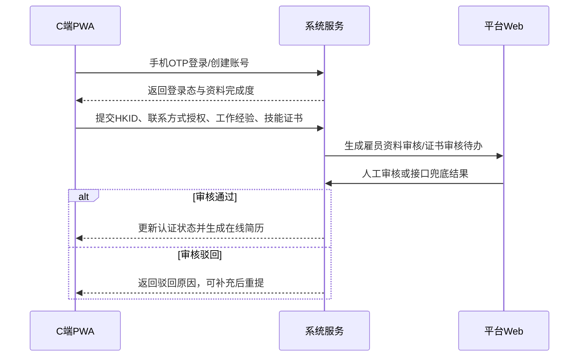

### 模块2：商户准入、定级与授信时序图

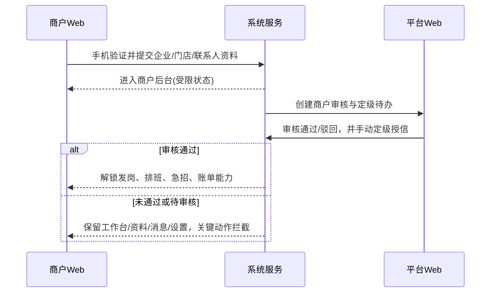

### 模块3：岗位发布、结算方式与授信校验时序图

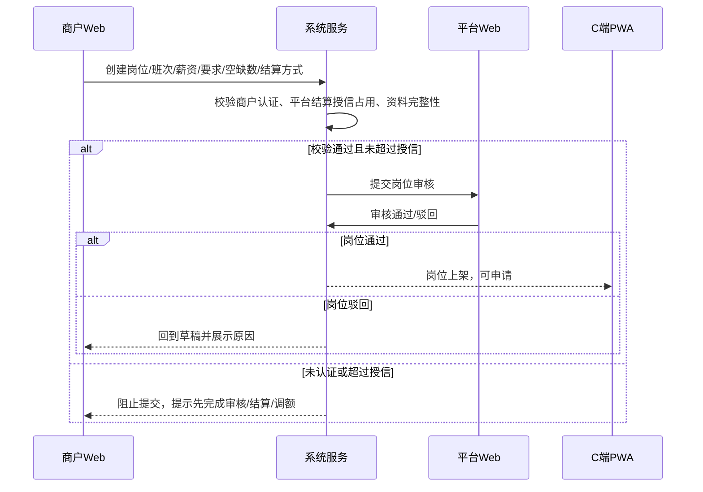

### 模块4：岗位申请、商户审核与排班时序图

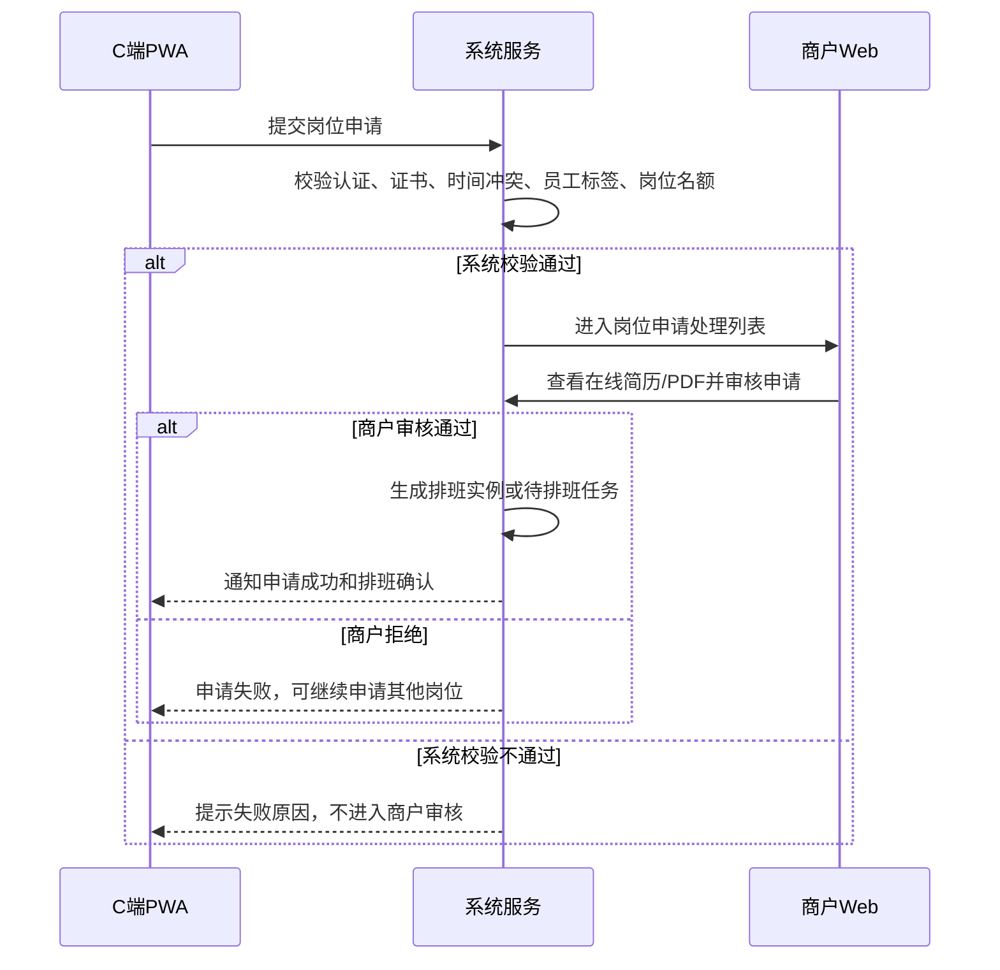

### 模块5：临时可上工与急招邀请时序图

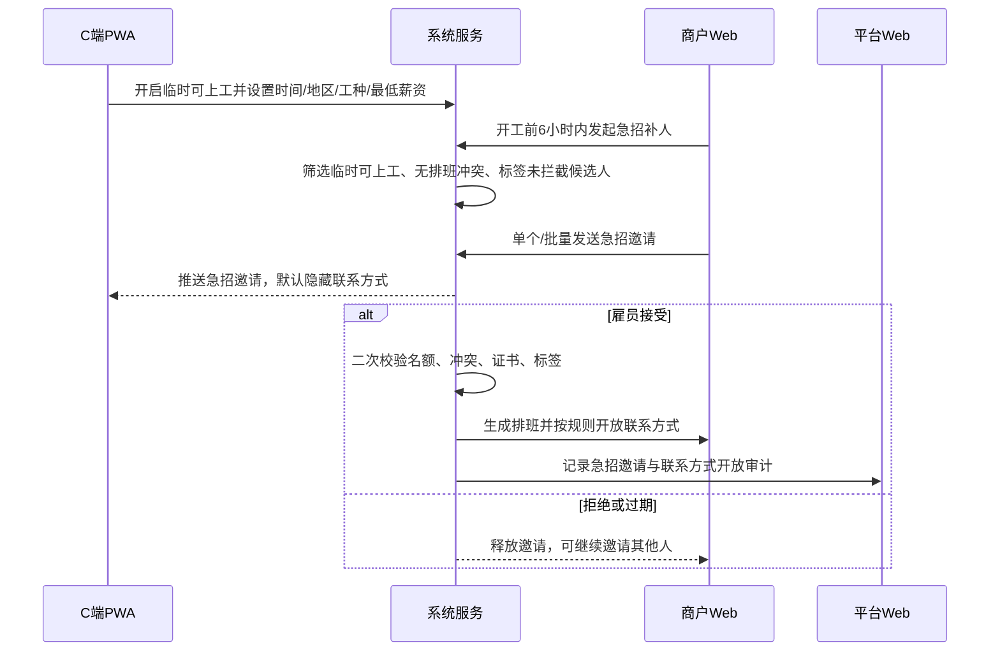

### 模块6：急聘岗位置顶时序图

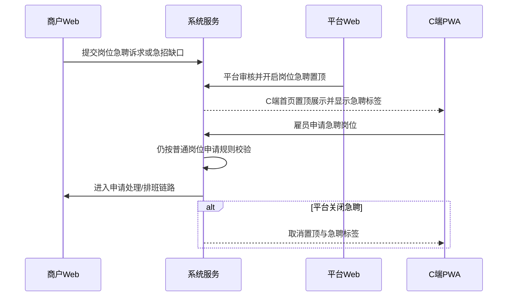

### 模块7：排班确认、提醒与调整单时序图

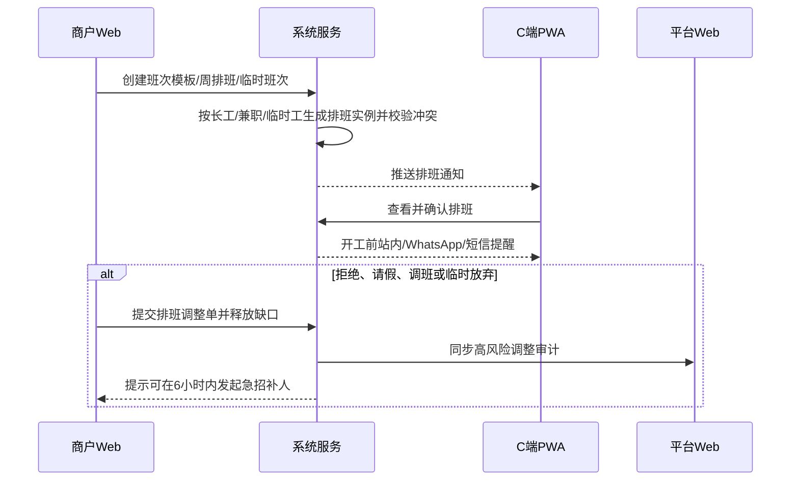

### 模块8：拍照打卡、异常与补卡时序图

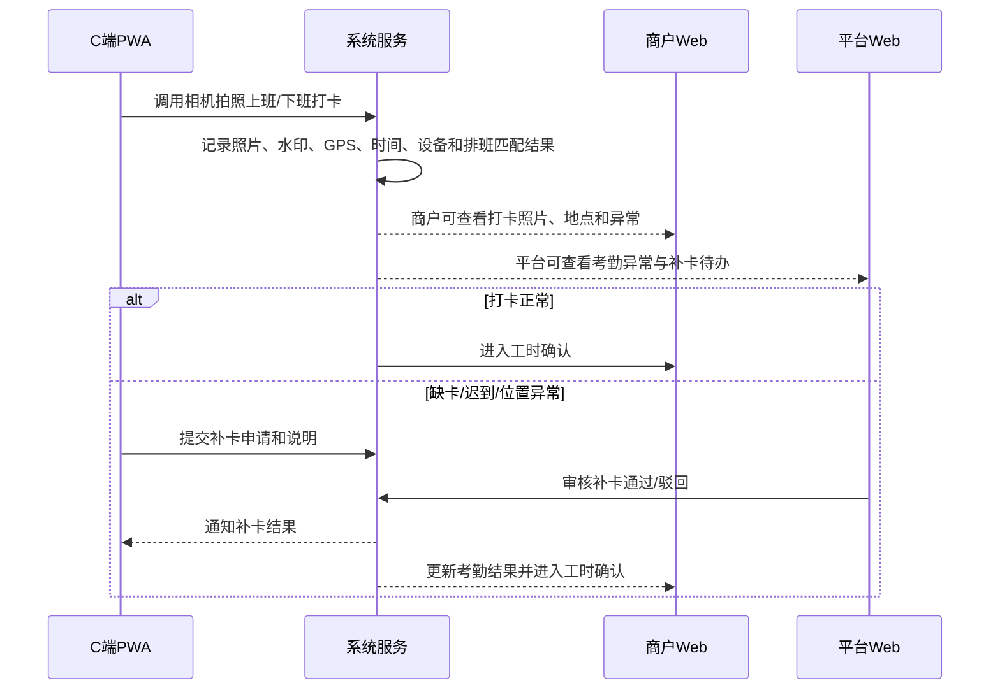

### 模块9：工时确认、风险复核与结算锁定时序图

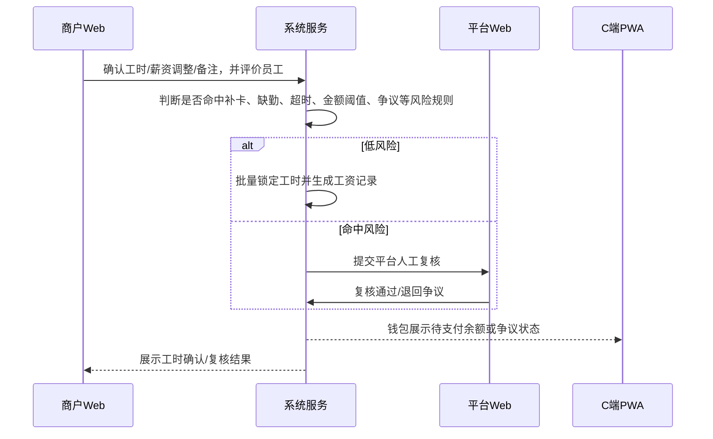

### 模块10：发薪/出粮申请与平台线下确认时序图

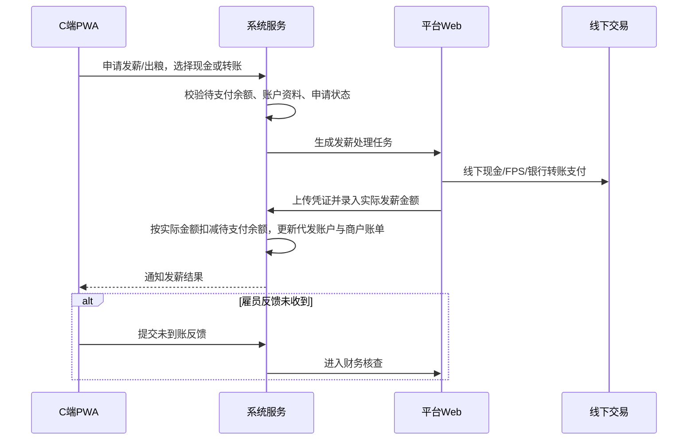

### 模块11：商户账单、异议、付款申请与确认收款时序图

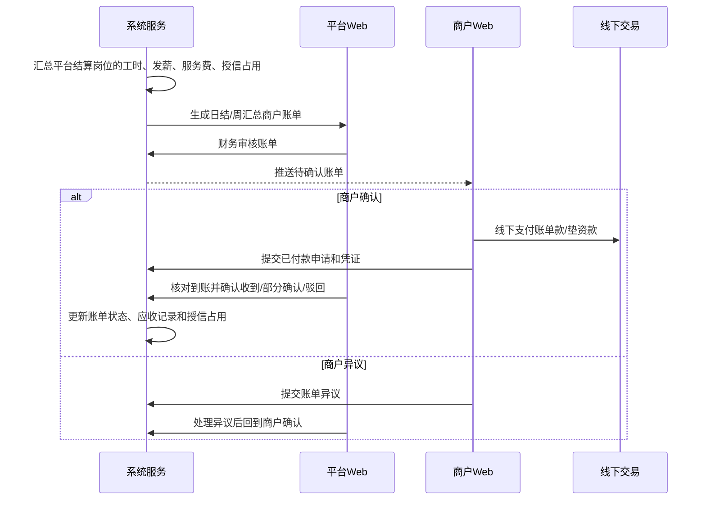

### 模块12：员工标签、通知与审计时序图

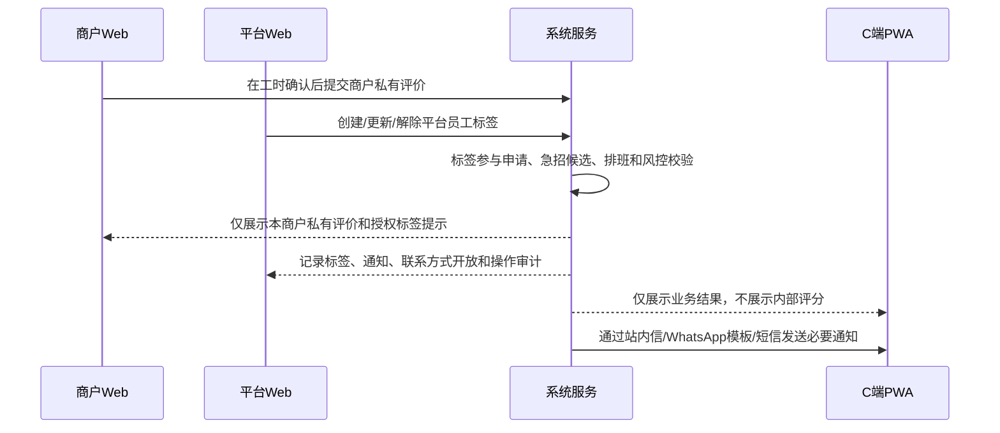


# Whatsapp消息推送：

WhatsApp 正确实现方式是接入 **WhatsApp Business Platform / Cloud API**：用企业 WhatsApp 号码，通过 Meta Graph API 给已授权用户发送一对一消息。

核心限制是：用户必须提供手机号并同意接收；

企业主动发起通知通常要用 Meta 审核通过的 Message Template；用户主动发来消息后的 24 小时内，才可自由回复非模板消息。官方政策明确要求手机号 \+ opt\-in，并规定 24 小时窗口外只能用 approved templates。\([whatsappbusiness\.com](https://whatsappbusiness.com/policy/)\)


**一、推荐实现方式**

NewBee MVP 采用：

`站内信主记录 + WhatsApp 模板消息提醒 + SMS/人工联系兜底`

不要把 WhatsApp 当唯一通知通道。系统所有通知先落 `notifications`，然后按用户授权和模板状态决定是否发 WhatsApp。WhatsApp 发送失败、模板未审核、用户未 opt\-in 时，降级为短信或人工联系。


官方 Cloud API 是基于 Graph API 的 HTTP 接口，发送消息就是请求 `/{PHONE_NUMBER_ID}/messages`，官方示例也是用 Bearer Token \+ JSON body 调用。\([meta\-preview\.mintlify\.io](https://meta-preview.mintlify.io/docs/whatsapp/cloud-api/overview)\)


**二、前置准备**

需要准备：

1. Meta Business Portfolio

2. WhatsApp Business Account，简称 `WABA`

3. WhatsApp Business Phone Number，即企业发送号码

4. Meta App

5. System User Access Token

6. 权限：`whatsapp_business_messaging` 用于收发消息，`whatsapp_business_management` 用于管理 WABA、模板、号码等资源。官方文档列了这些权限。\([meta\-preview\.mintlify\.io](https://meta-preview.mintlify.io/docs/whatsapp/cloud-api/overview)\)

7. Webhook 公网回调地址，用于接收用户回复、消息送达状态、失败原因等。官方说明 Cloud API 依赖 Webhooks 接收用户消息和发送状态。\([meta\-preview\.mintlify\.io](https://meta-preview.mintlify.io/docs/whatsapp/cloud-api/overview)\)

**三、NewBee 业务消息类型**

MVP 只建议做服务通知，不做营销群发。

|场景|模板类型|触发对象|
|---|---|---|
|登录/验证码|Authentication|雇员、商户|
|岗位申请结果|Utility|雇员|
|排班确认/开工提醒|Utility|雇员|
|急招邀请|Utility|雇员|
|打卡异常/补卡结果|Utility|雇员|
|发薪/出粮结果|Utility|雇员|
|商户审核/岗位审核结果|Utility|商户负责人|
|账单/回款提醒|Utility|商户负责人|


**四、发送主流程**

```Plain Text
业务事件产生
  -> 创建站内通知 notifications
  -> 判断用户是否开启 WhatsApp 工作提醒
  -> 判断手机号是否有效、是否有 opt-in
  -> 匹配 WhatsApp 模板
  -> 生成模板变量
  -> 写入 notification_channel_logs
  -> 调用 Meta Cloud API
  -> 保存 wamid/message_id
  -> 等待 Webhook 回调更新状态
  -> 失败则重试或降级 SMS/人工联系
```


**五、接口示例**

发送模板消息：


```HTTP
POST https://graph.facebook.com/v{version}/{PHONE_NUMBER_ID}/messages
Authorization: Bearer {ACCESS_TOKEN}
Content-Type: application/json
```


```JSON
{
  "messaging_product": "whatsapp",
  "recipient_type": "individual",
  "to": "85261234567",
  "type": "template",
  "template": {
    "name": "newbee_shift_reminder_zh_hk",
    "language": { "code": "zh_HK" },
    "components": [
      {
        "type": "body",
        "parameters": [
          { "type": "text", "text": "中环展会临时助理" },
          { "type": "text", "text": "2026-06-10 09:00" },
          { "type": "text", "text": "中环会展中心" }
        ]
      }
    ]
  }
}
```


24 小时客服窗口内可发自由文本：


```JSON
{
  "messaging_product": "whatsapp",
  "recipient_type": "individual",
  "to": "85261234567",
  "type": "text",
  "text": {
    "preview_url": false,
    "body": "你的补卡申请已通过，请查看排班详情。"
  }
}
```


但 NewBee 系统通知不要依赖自由文本，因为大多数提醒是系统主动触发，通常发生在 24 小时窗口外，应默认走模板。


**六、Webhook 逻辑**

Webhook 要处理两类事件：


1. 用户发来的消息  

用于打开 24 小时服务窗口、记录用户回复、处理“停止接收”等退订词。


2. 消息状态回执  

更新发送状态：`sent / delivered / read / failed`。官方文档说明 Webhook 会承载用户发来的消息和外发消息状态。\([meta\-preview\.mintlify\.io](https://meta-preview.mintlify.io/docs/whatsapp/cloud-api/overview)\)


Webhook 状态流：


```Plain Text
pending -> sending -> accepted -> sent -> delivered -> read
                         └-> failed -> retrying -> fallback_sent / manual_required
```


**七、建议数据表**

```Plain Text
user_notification_preferences
- user_id
- whatsapp_phone
- whatsapp_opt_in
- whatsapp_opt_in_at
- whatsapp_opt_out_at
- work_reminder_enabled
- payout_notice_enabled
- urgent_invite_enabled

whatsapp_message_templates
- id
- template_name
- language_code
- category
- business_scene
- meta_status
- variable_schema
- last_synced_at

notifications
- id
- recipient_user_id
- business_type
- business_id
- title
- content
- priority
- status

notification_channel_logs
- id
- notification_id
- channel: in_app / whatsapp / sms / manual
- template_name
- phone_number
- request_payload
- provider_message_id
- status
- error_code
- error_message
- sent_at
- delivered_at
- read_at
```


**八、官方文档入口**

- [WhatsApp Business Messaging Policy](https://whatsappbusiness.com/policy/)：opt\-in、24 小时窗口、模板消息、退订要求。

- [Cloud API Overview](https://developers.facebook.com/docs/whatsapp/cloud-api/overview)：Cloud API、WABA、企业号码、模板、Webhook、权限。

- [Messages API Reference](https://developers.facebook.com/docs/whatsapp/cloud-api/reference/messages)：发送 text/template/media/interactive 消息。

- [Send Message Templates](https://developers.facebook.com/docs/whatsapp/cloud-api/guides/send-message-templates)：模板消息发送方式。

- [Message Templates API](https://developers.facebook.com/docs/whatsapp/business-management-api/message-templates)：模板创建、查询、审核状态。

- [Webhooks for WhatsApp](https://developers.facebook.com/docs/graph-api/webhooks/getting-started/webhooks-for-whatsapp)：Webhook 配置和回调。

- [WhatsApp Manager](https://business.facebook.com/wa/manage/home/)：人工管理 WABA、号码、模板、质量评分。

    

结论：NewBee 可以做 WhatsApp 消息提醒，但要按“授权手机号 \+ 模板消息 \+ Webhook 回执 \+ 失败兜底”的通知系统来做，不能按微信公众号订阅推送来设计。

> (注：内容由 AI 生成，请谨慎参考）
